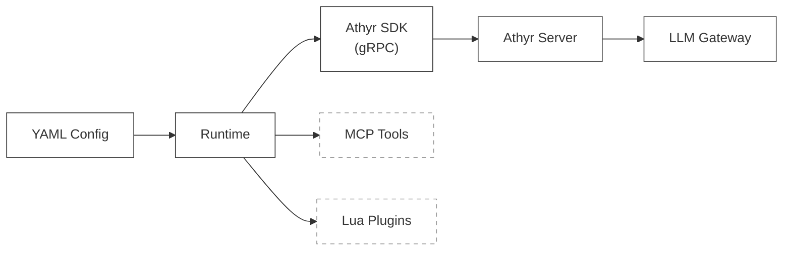

# athyr-agent

YAML-driven agent runner for [Athyr](https://athyr.tech). Define AI agents in YAML, connect them to an Athyr
server, and let them process messages through LLMs — no code required.



## Install

```bash
# From source
go install github.com/athyr-tech/athyr-agent/cmd/athyr-agent@latest

# Or build locally
git clone https://github.com/athyr-tech/athyr-agent.git
cd athyr-agent
make build
```

Requires Go 1.25+ and a running [Athyr server](https://github.com/athyr-tech/athyr-bin).

## Quick Start

Create an agent YAML file:

```yaml
# agent.yaml
agent:
  name: my-agent
  description: A simple agent
  model: google/gemini-2.5-flash-lite
  instructions: |
    You are a helpful assistant. Respond concisely.
  topics:
    subscribe: [ requests.new ]
    publish: [ requests.done ]
```

Run it:

```bash
athyr-agent run agent.yaml --server localhost:9090
```

Or with the built-in TUI:

```bash
athyr-agent run agent.yaml --server localhost:9090 --tui
```

## Features

### Topics (Pub/Sub)

Agents subscribe to input topics and publish responses to output topics. Messages flow through the Athyr server.

```yaml
topics:
  subscribe: [ documents.new ]
  publish: [ summaries.ready ]
```

### Dynamic Routing

Route messages to different topics based on LLM analysis:

```yaml
topics:
  subscribe: [ ticket.new ]
  publish: [ ticket.unknown ]       # Default fallback
  routes:
    - topic: ticket.billing
      description: Payment and invoice issues
    - topic: ticket.technical
      description: Bugs and technical problems
```

### MCP Tools

Give agents access to external tools via [MCP](https://modelcontextprotocol.io/) servers:

```yaml
mcp:
  servers:
    - name: docker-gateway
      command: [ "docker", "mcp", "gateway", "run" ]
```

### Memory

Enable multi-turn conversations with session persistence:

```yaml
memory:
  enabled: true
  profile:
    type: rolling_window
    max_tokens: 4096
```

### Lua Plugins

Extend agents with custom event sources and destinations written in Lua. See [docs/plugins.md](docs/plugins.md) for the
full guide.

```yaml
plugins:
  - name: file-watcher
    file: ./plugins/watcher.lua
    config:
      path: /var/log/app
      interval: 5
```

## CLI Commands

```bash
athyr-agent run <file>        # Run an agent
athyr-agent validate <file>   # Validate YAML without running
athyr-agent version           # Print version info
athyr-agent disconnect <id>   # Disconnect an agent from Athyr
```

### Flags

| Flag           | Description                                      |
|----------------|--------------------------------------------------|
| `--server`     | Athyr server address (default: `localhost:9090`) |
| `--insecure`   | Disable TLS                                      |
| `--tui`        | Run with interactive terminal UI                 |
| `--verbose`    | Enable debug logging                             |
| `--log-format` | Log format: `text` or `json`                     |

## Examples

See [`examples/`](examples/) for ready-to-run agents:

| Example                                    | Description                          | Run                       |
|--------------------------------------------|--------------------------------------|---------------------------|
| [simple-test](examples/simple-test.yaml)   | Basic connectivity test              | `make run-simple-tui`     |
| [summarizer](examples/summarizer.yaml)     | Document summarization               | `make run-summarizer-tui` |
| [memory-chat](examples/memory-chat.yaml)   | Multi-turn conversations             | `make run-memory-tui`     |
| [mcp-tools](examples/mcp-tools.yaml)       | Research with MCP tools              | `make run-mcp-tui`        |
| [plugin-agent](examples/plugin-agent.yaml) | Lua plugins (file watcher + webhook) | `make run-plugin`         |
| [demo/](examples/demo/)                    | Multi-agent support workflow         | `make run-classifier-tui` |

## Documentation

- [Configuration Reference](docs/configuration.md) — All YAML options
- [Lua Plugins Guide](docs/plugins.md) — Writing and using plugins
- [Examples README](examples/README.md) — TUI guide and example details

## Development

```bash
make build      # Build binary
make test       # Run tests
make install    # Install to $GOPATH/bin
make help       # Show all targets
```

## License

MIT License. See [LICENSE](LICENSE).
