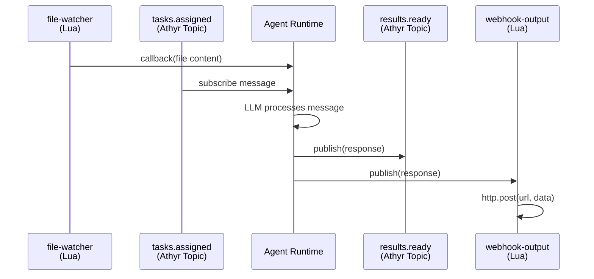

# Configuration Reference

Agent configuration is a single YAML file with all settings under the `agent` key.

## Minimal Example

```yaml
agent:
  name: my-agent
  model: google/gemini-2.5-flash-lite
  topics:
    subscribe: [input]
    publish: [output]
```

## Full Example

```yaml
agent:
  name: file-processor
  description: Watches for new files and posts results to a webhook
  model: google/gemini-2.5-flash-lite
  instructions: |
    You are a helpful assistant. Summarize any content you receive.

  topics:
    subscribe:
      - file-watcher    # Plugin source — polls the host filesystem for new files
      - tasks.assigned  # Athyr topic — receives messages from other agents
    publish:
      - results.ready   # Athyr topic — other agents can subscribe to this
      - webhook-output  # Plugin destination — posts to an external webhook

  memory:
    enabled: true
    profile:
      type: rolling_window
      max_tokens: 4096
      summarization_threshold: 3000

  mcp:
    servers:
      - name: docker-gateway
        command: ["docker", "mcp", "gateway", "run"]

  # Plugin names must match what's used in topics.subscribe / topics.publish
  plugins:
    - name: file-watcher
      file: ./plugins/watcher.lua
      config:
        path: /var/log/app
        interval: 5

    - name: webhook-output
      file: ./plugins/http-output.lua
      config:
        url: https://hooks.example.com/notify

  connection:
    timeout: 60s
    max_retries: 0
    base_backoff: 1s
    max_backoff: 30s
```

The data flow for this example:



---

## `agent`

Top-level agent configuration.

| Field | Type | Required | Description |
|-------|------|----------|-------------|
| `name` | string | yes | Unique agent name, used for registration with Athyr |
| `description` | string | no | Human-readable description |
| `model` | string | yes | LLM model identifier (e.g., `google/gemini-2.5-flash-lite`, `openai/gpt-4o-mini`) |
| `instructions` | string | no | System prompt sent to the LLM with every request |
| `topics` | object | yes | Pub/sub topic configuration |
| `memory` | object | no | Session memory settings |
| `mcp` | object | no | MCP tool server connections |
| `plugins` | list | no | Lua plugin definitions |
| `connection` | object | no | SDK connection tuning |

---

## `agent.topics`

Defines which topics the agent subscribes to and publishes on.

| Field | Type | Required | Description |
|-------|------|----------|-------------|
| `subscribe` | list of strings | yes | Topics to receive messages from (at least one) |
| `publish` | list of strings | yes | Topics to send responses to (at least one) |
| `routes` | list of objects | no | Dynamic routing destinations |

Topic names can refer to Athyr topics or Lua plugin names. When a topic name matches a plugin's `name`, the runner routes through the plugin for that topic. Athyr topics and plugins can be mixed freely — for example, subscribe to a plugin source and an Athyr topic, or publish to both.

### `agent.topics.routes[]`

Dynamic routing lets the LLM decide where to send its response. When routes are configured, routing instructions are appended to the system prompt automatically.

| Field | Type | Required | Description |
|-------|------|----------|-------------|
| `topic` | string | yes | Destination topic name |
| `description` | string | yes | What this route is for (included in LLM prompt) |

The LLM returns a JSON response with a `route_to` field. If the route is valid, the response goes to that topic. If invalid or missing, the response goes to the default `publish` topics.

```yaml
topics:
  subscribe: [ticket.new]
  publish: [ticket.unknown]
  routes:
    - topic: ticket.billing
      description: Payment issues, invoices, refunds
    - topic: ticket.technical
      description: Bugs, errors, crashes
```

---

## `agent.memory`

Enables multi-turn conversation memory via Athyr's session system. Messages must include a `session_id` field in their JSON payload for memory to activate.

| Field | Type | Required | Default | Description |
|-------|------|----------|---------|-------------|
| `enabled` | bool | no | `false` | Enable session memory |
| `session_prefix` | string | no | — | Prefix for session IDs |
| `ttl` | string | no | — | Session time-to-live (e.g., `1h`, `24h`) |
| `profile` | object | no | — | Memory behavior settings |

### `agent.memory.profile`

| Field | Type | Required | Default | Description |
|-------|------|----------|---------|-------------|
| `type` | string | no | `rolling_window` | Memory management strategy |
| `max_tokens` | int | no | `4096` | Maximum tokens kept in memory |
| `summarization_threshold` | int | no | `3000` | Token count that triggers summarization of older messages |

```yaml
memory:
  enabled: true
  profile:
    type: rolling_window
    max_tokens: 4096
    summarization_threshold: 3000
```

### Message format with session

```json
{"session_id": "user-123", "content": "Hello, remember me?"}
```

Plain text messages (without `session_id`) are processed normally without memory.

---

## `agent.mcp`

Connects to MCP servers that provide tools for the LLM. Tools are discovered automatically on startup and passed to the LLM with each completion request.

### `agent.mcp.servers[]`

Each server uses either a local subprocess (stdio) or a remote endpoint (HTTP). Specify exactly one of `command` or `url`.

| Field | Type | Required | Description |
|-------|------|----------|-------------|
| `name` | string | yes | Identifier for this server |
| `command` | list of strings | one of command/url | Subprocess command and args (stdio transport) |
| `url` | string | one of command/url | Remote server endpoint (Streamable HTTP transport) |
| `env` | map of strings | no | Environment variables for subprocess commands |

```yaml
mcp:
  servers:
    # Stdio transport (local subprocess)
    - name: docker-gateway
      command: ["docker", "mcp", "gateway", "run"]
      env:
        API_KEY: "sk-..."

    # HTTP transport (remote server)
    - name: remote-tools
      url: https://mcp.example.com/tools
```

---

## `agent.plugins`

Lua plugins act as custom event sources (subscribe) and destinations (publish). See [plugins.md](plugins.md) for the full guide on writing plugins.

### `agent.plugins[]`

| Field | Type | Required | Description |
|-------|------|----------|-------------|
| `name` | string | yes | Unique name, referenced in `topics.subscribe` or `topics.publish` |
| `file` | string | yes | Path to the Lua file |
| `config` | map | no | Key-value pairs passed to the Lua `subscribe`/`publish` function |
| `restrict` | list of strings | no | Bridge APIs to block (e.g., `http`, `fs.write`) |

Plugin names must be unique. The `name` is used as a topic name in the `subscribe`/`publish` lists.

```yaml
plugins:
  - name: file-watcher
    file: ./plugins/watcher.lua
    config:
      path: /var/log/app
      interval: 5

  - name: slack-output
    file: ./plugins/slack.lua
    config:
      webhook_url: https://hooks.slack.com/...
    restrict:
      - fs          # No filesystem access
```

### Restrictions

| Value | Effect |
|-------|--------|
| `http` | Blocks `http.get` and `http.post` |
| `fs` | Blocks `fs.read`, `fs.write`, and `fs.list` |
| `fs.write` | Blocks only `fs.write` |
| `fs.read` | Blocks only `fs.read` |
| `http.post` | Blocks only `http.post` |
| `json.encode` | Blocks only `json.encode` |
| `json.decode` | Blocks only `json.decode` |

---

## `agent.connection`

Tunes the SDK connection to the Athyr server. All fields are optional with sensible defaults.

| Field | Type | Required | Default | Description |
|-------|------|----------|---------|-------------|
| `timeout` | duration | no | `60s` | Request timeout |
| `max_retries` | int | no | `0` (infinite) | Max reconnection retries |
| `base_backoff` | duration | no | `1s` | Initial backoff between retries |
| `max_backoff` | duration | no | `30s` | Maximum backoff duration |

Duration values use Go syntax: `30s`, `2m`, `1h`.

```yaml
connection:
  timeout: 120s
  max_retries: 10
  base_backoff: 2s
  max_backoff: 60s
```

---

## Validation

Validate a config file without running it:

```bash
athyr-agent validate agent.yaml
```

Validation checks:
- `name` and `model` are present
- At least one subscribe and one publish topic
- Plugin names are unique and have a `file` path
- Route entries have both `topic` and `description`
- MCP servers have a `name` and exactly one of `command`/`url`
- Duration strings are valid and non-negative
