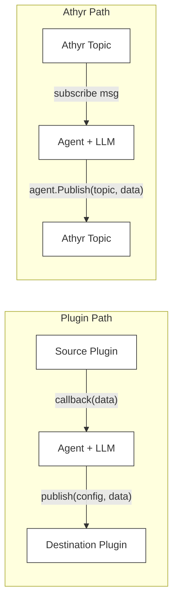

# Lua Plugins

Plugins let agents subscribe to and publish events beyond Athyr topics. A file-watcher plugin can trigger the agent when new files appear; an HTTP plugin can post responses to a webhook. Plugins are Lua scripts that implement a simple contract.

## Quick Start

1. Write a Lua plugin:

```lua
-- my-source.lua
local fs = require("fs")

function subscribe(config, callback)
    while true do
        local entries = fs.list(config.path)
        for i = 1, #entries do
            callback(entries[i])
        end
        sleep(config.interval or 5)
    end
end
```

2. Reference it in your agent YAML:

```yaml
agent:
  name: my-agent
  model: google/gemini-2.5-flash-lite
  instructions: Process incoming data.

  topics:
    subscribe:
      - my-source       # Plugin name — matched to plugin below
    publish:
      - results.ready   # Athyr topic for output

  plugins:
    - name: my-source
      file: ./plugins/my-source.lua
      config:
        path: /var/log/app
        interval: 10
```

3. Run:

```bash
athyr-agent run agent.yaml --server localhost:9090
```

The runner detects that `my-source` is a plugin (not an Athyr topic) and calls its `subscribe` function instead of subscribing via the SDK.

## How Plugins Interact with the Agent

The key rule: **a plugin's `name` must appear in `topics.subscribe` or `topics.publish`** for it to be wired into the agent. Just defining a plugin under `plugins:` does nothing on its own.

- **Source plugin** (name in `topics.subscribe`): The runner calls `subscribe(config, callback)`. When the Lua code calls `callback(data)`, the data enters the agent as a message — it goes through the LLM, tool calls, routing, and produces a response.

- **Destination plugin** (name in `topics.publish`): When the agent produces a response, instead of publishing to an Athyr topic, it calls the plugin's `publish(config, data)` with the response content.

- **Athyr topics and plugins can be mixed** in the same agent. For example, subscribe to both a plugin source and an Athyr topic, or publish to both an Athyr topic and a plugin destination.



## Plugin Contract

A plugin is a Lua file that defines one or both of these functions:

### Source Plugin: `subscribe(config, callback)`

Called when the agent starts. Runs in its own goroutine. Call `callback(data)` to feed data into the agent — the agent processes it the same way it would process a message from an Athyr topic.

```lua
function subscribe(config, callback)
    -- config: table with values from YAML config section
    -- callback: function(string) — sends data to the agent
end
```

### Destination Plugin: `publish(config, data)`

Called each time the agent produces a response destined for this plugin.

```lua
function publish(config, data)
    -- config: table with values from YAML config section
    -- data: string — the agent's response content
end
```

## YAML Configuration

```yaml
plugins:
  - name: file-watcher          # Unique name, referenced in topics
    file: ./plugins/watcher.lua  # Path to Lua file
    config:                      # Passed as first argument to subscribe/publish
      path: /var/log/app
      interval: 5
    restrict:                    # Optional: limit what the plugin can do
      - http
      - fs.write
```

Plugins are wired into the agent through `topics.subscribe` and `topics.publish` — use the plugin's `name` as the topic name.

## Bridge Modules

Plugins run in a sandboxed Lua VM with access to these Go-backed modules:

### `fs` — File System

```lua
local fs = require("fs")

local content = fs.read("/path/to/file")    -- returns string
fs.write("/path/to/file", "data")           -- writes string to file
local entries = fs.list("/path/to/dir")     -- returns table of filenames
```

### `http` — HTTP Client

```lua
local http = require("http")

-- GET request
local resp = http.get("https://api.example.com/data")
-- resp.body   = response body (string)
-- resp.status = HTTP status code (number)

-- POST request with headers
local resp = http.post(
    "https://api.example.com/webhook",
    '{"key": "value"}',
    {["Content-Type"] = "application/json"}
)
```

### `json` — JSON Encoding/Decoding

```lua
local json = require("json")

local str = json.encode({name = "test", count = 42})
local tbl = json.decode('{"name": "test", "count": 42}')
```

### `sleep(seconds)` — Global

```lua
sleep(5)      -- sleep 5 seconds
sleep(0.1)    -- sleep 100 milliseconds
```

### `log(level, message)` — Global

```lua
log("info", "processing started")
log("error", "something went wrong")
-- levels: debug, info, warn, error
```

## Restrictions

Restrict what a plugin can access using the `restrict` field:

```yaml
plugins:
  - name: community-formatter
    file: ./plugins/formatter.lua
    restrict:
      - http           # Blocks all http.* functions
      - fs.write       # Blocks fs.write only, allows fs.read and fs.list
```

Restrictions work at two levels:
- **Module level**: `http` blocks `http.get` and `http.post`
- **Function level**: `fs.write` blocks only `fs.write`, leaving `fs.read` and `fs.list` available

This lets you run community plugins with limited permissions.

## Sandbox

Each plugin runs in its own Lua VM with:
- Only safe standard libraries loaded (`base`, `table`, `string`, `math`, `package`)
- `dofile` and `loadfile` removed (no arbitrary file execution)
- Separate state — plugins cannot interfere with each other

## Examples

See `examples/plugins/` for working examples:

- **`file-watcher.lua`** — Source plugin that polls a directory for new files
- **`http-output.lua`** — Destination plugin that posts responses to a webhook
- **`plugin-agent.yaml`** — Agent config wiring both plugins together
